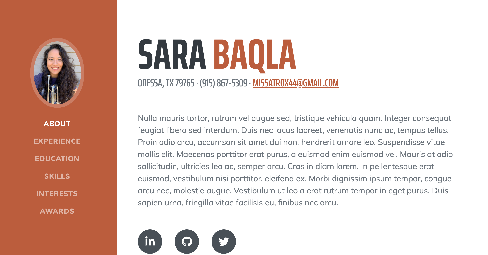

# Sara Baqla's Portfolio

## [Deployed Website](https://missatrox44.github.io/portfolio/)

## Description
This portfolio was created to showcase Sara Baqla's past, current and upcoming projects. This portfolio also gives the user an insight into who Sara is and her background.

## Table of Contents
- [Usage](#Usage)
- [Site Preview](#Preview)  
- [License](#License)
- [Contributing](#Contributing)
- [Questions](#Questions)

## Usage
The user can visit the portfolio and learn more about Sara Baqla's experience, education, skills, interests and projects. Links in the fixed navigation bar will send the user to the corresponding section.

## Preview

## License
MIT

## Contributing
[Sara Baqla](https://github.com/missatrox44)  
[Start Bootstrap Template](https://startbootstrap.com/theme/resume)

## Questions
Github username: [missatrox44](https://github.com/missatrox44)  
Email: missatrox44@gmail.com